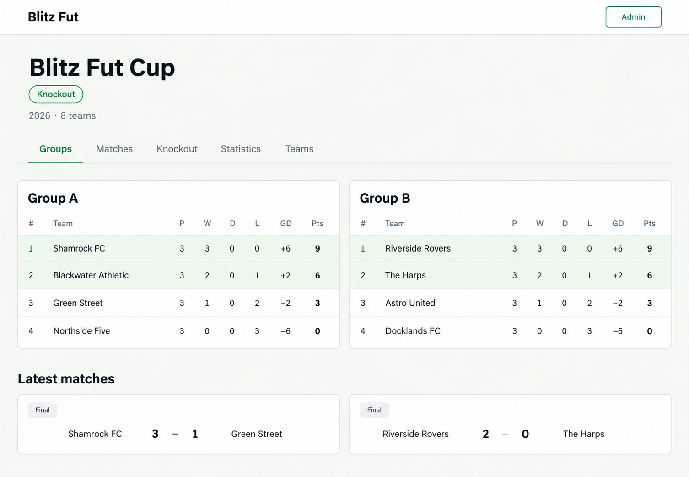
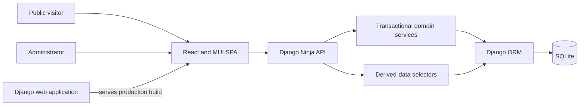

# Blitz Fut

[](LICENSE)

Blitz Fut is a mobile-first web application for organizing an astro five-a-side
football cup among friends. It covers the complete competition lifecycle, from
initial format configuration and team setup through group standings, knockout
progression, the final, and an optional third-place match.

The MVP is implemented, covered by automated backend tests, and has completed
manual end-to-end acceptance testing. Deployment to PythonAnywhere is the next
release step.



_This is an AI-generated design preview based on the implemented React/MUI
interface, not a pixel-exact application screenshot. Additional previews and
their prompts are available in [docs/ui-previews](docs/ui-previews)._

## Features

- Configure the number of teams, groups, qualifiers per group, and whether to
  include a third-place match before creating teams.
- Create teams and reusable players, manage rosters, and assign or randomize
  group membership.
- Generate a deterministic single round-robin group schedule.
- Enter match results by distributing goals and assists across each team's
  roster, including own goals received.
- Derive match scores, standings, qualification positions, top scorers, and top
  assisters from source statistics.
- Detect unresolved standings ties and record a confirmed drawing-of-lots order.
- Generate and progress a deterministic single-elimination bracket with a final
  and optional third-place match.
- Resolve tied knockout matches by selecting the advancing team after penalties,
  without storing an unnecessary penalty score.
- Provide public, read-only competition pages and a protected administrator
  workflow.
- Back up and restore the SQLite database using application-aware management
  commands.

## Engineering highlights

- Domain rules live in transactional service functions rather than API handlers.
- Selectors calculate standings, match scores, leaderboards, and competition
  state from authoritative source records.
- Django constraints protect persisted invariants, while Pydantic schemas define
  JSON API contracts.
- Django Ninja exposes a same-origin API consumed by a separate React frontend.
- Administrator writes use server-side session authorization and CSRF protection.
- Passwords use Django's Argon2id password hasher; secrets and live data remain
  outside version control.
- The responsive interface uses a deliberately small off-white, near-black, and
  football-green visual palette.

## Architecture



The repository is organized as a monorepo:

```text
backend/   Django application, domain model, API, operations, and pytest suite
frontend/  React, TypeScript, Vite, and MUI single-page application
docs/      Product decisions, data model, operations, and visual previews
```

The detailed design is documented in the [product brief](docs/product-brief.md)
and [data model](docs/data-model.md).

## Technology stack

| Area | Technology |
|---|---|
| Backend | Python 3.13, Django 5.2 LTS |
| API and validation | Django Ninja, Pydantic |
| Database | SQLite with Django migrations |
| Frontend | React 19, TypeScript, MUI |
| Frontend tooling | Vite, Node.js 24 LTS, npm |
| Authentication | Django sessions, Argon2id, CSRF protection |
| Tests | pytest and pytest-django |
| Hosting target | PythonAnywhere |

## Run locally

Prerequisites are Python 3.13, `uv`, Node.js 24 LTS, and npm. Clone the
repository and run the local launcher:

```bash
git clone https://github.com/chriiscardozo/blitz_fut.git
cd blitz_fut
./run-local.sh
```

The launcher prepares the Python environment when `uv` is available, uses a
project-local Node installation when present, installs missing frontend packages,
builds the React application, applies migrations, runs Django's checks, and
starts the complete application at `http://127.0.0.1:8000`.

On the first run it interactively creates the single administrator account if
one does not exist. Local secrets, data, virtual environments, dependencies, and
build output are excluded from Git.

Run preparation without starting the server:

```bash
./run-local.sh --prepare-only
```

## Verification

The backend currently has 114 pytest tests covering the domain services, models,
derived reads, authentication, API behavior, and SQLite operations.

```bash
cd backend
.venv/bin/pytest
```

Validate and build the frontend:

```bash
cd frontend
npm run typecheck
npm run build
```

## Deployment and operations

The deployment target is a single PythonAnywhere web application using a
persistent SQLite database outside the Git checkout. The Vite production build
is generated locally and transferred separately because generated files are not
committed to the portfolio branch.

The complete deployment, backup, restoration, and smoke-test procedures are in
the [operations runbook](docs/operations.md).

## AI-assisted development

Blitz Fut was built through human-AI collaboration. I owned the product
requirements and decisions, reviewed the implementation, and completed manual
acceptance testing. OpenAI Codex agents assisted with requirements refinement,
architecture discussions, implementation, automated tests, documentation, and
development tooling.

The generated UI design-preview prompts are retained in
[docs/ui-previews/prompts.md](docs/ui-previews/prompts.md) as an additional record
of that process.

## Author and license

Created by Christian Cardozo
([@chriiscardozo](https://github.com/chriiscardozo)).

Blitz Fut is available under the [MIT License](LICENSE). Reuse is welcome, and
the license requires the copyright and permission notice to be retained in
copies or substantial portions of the software.
