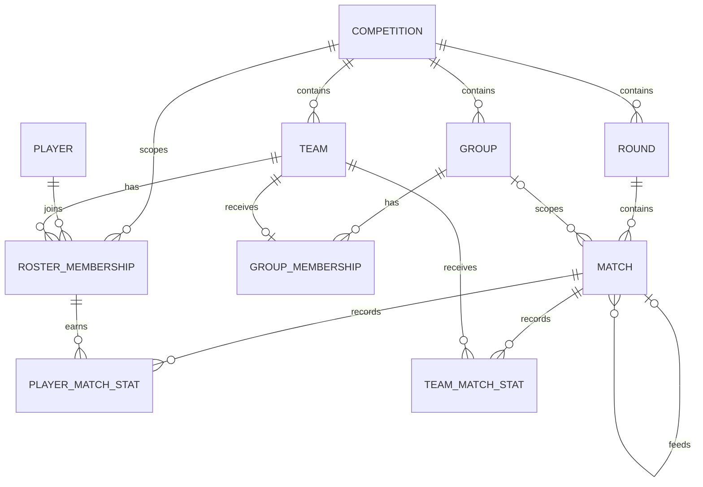
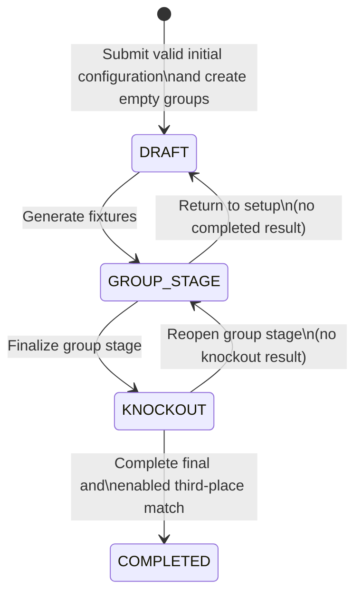

# Blitz Fut — Data Model

Status: Initial model implemented
Last updated: 2026-09-17
Related document: [Product brief](product-brief.md)

## 1. Purpose

This document translates the approved MVP rules into an initial Django ORM model. It defines persisted source data, derived data, lifecycle transitions, validation ownership, and the transactions that protect competition consistency.

This is an implementation model rather than a public API contract. Django Ninja and Pydantic schemas will be designed separately around the use cases exposed by the API.

## 2. Modeling principles

- Use Django ORM models and migrations with SQLite.
- Use Django's default `BigAutoField` primary keys unless a later API decision requires another external identifier.
- Keep persisted source data normalized and derive scores, standings, qualification positions, and leaderboards.
- Put simple row-local invariants in database constraints.
- Put cross-row, aggregate, and lifecycle invariants in transactional domain services.
- Treat a competition edition as the aggregate boundary for structural operations.
- Preserve completed competition history; destructive editing is limited to explicitly permitted setup and reopening workflows.
- Do not persist incomplete match-result drafts.
- Do not add a separate drawing-of-lots resolution model for the MVP.

## 3. Entity overview



The single administrator uses Django's built-in user, session, and permission models. Blitz Fut does not need a custom account model.

## 4. Proposed Django models

The initial Django declarations implement the fields below. Cross-row rules remain the responsibility of the transactional services described later in this document.

### 4.1 `Competition`

One configured cup edition.

| Field | Proposed type | Rules |
| --- | --- | --- |
| `id` | `BigAutoField` | Primary key. |
| `name` | `CharField` | Required display name. |
| `year` | `PositiveSmallIntegerField` | Required competition year. |
| `status` | `CharField` with choices | `DRAFT`, `GROUP_STAGE`, `KNOCKOUT`, or `COMPLETED`. |
| `group_count` | `PositiveSmallIntegerField` | `G`; must be a power of two. |
| `teams_per_group` | `PositiveSmallIntegerField` | `M >= 2`. |
| `qualifiers_per_group` | `PositiveSmallIntegerField` | `Q`; power of two and `Q <= M`. |
| `third_place_enabled` | `BooleanField` | May be true only when `G × Q >= 4`. |

The administrator enters total team count `T` during the initial creation step. The creation service requires `T` to divide evenly by `G`, stores the derived `M = T / G` in `teams_per_group`, and creates the `G` empty group rows in the same transaction. `T` remains derived as `G × M` rather than being stored in a second column.

The following are derived and are not columns:

- Total participating teams: `G × M`.
- Total knockout teams: `K = G × Q`.
- Team and group-assignment lock state.
- Roster-lock state.
- Champion.

The status represents the active phase, not every condition within that phase. For example, whether all group matches are complete is derived from the matches.

### 4.2 `Group`

A group within one competition.

| Field | Proposed type | Rules |
| --- | --- | --- |
| `id` | `BigAutoField` | Primary key. |
| `competition` | `ForeignKey(Competition)` | Required; cascading aggregate relationship. |
| `ordinal` | `PositiveSmallIntegerField` | Stable order within the competition; displayed as A, B, C, and so on. |

Constraints:

- Unique `(competition, ordinal)`.
- The number of groups must equal `competition.group_count` before fixtures are generated.

The display label is derived from `ordinal`, so renaming a group cannot produce inconsistent ordering.

### 4.3 `Team`

A team participating in exactly one competition edition.

| Field | Proposed type | Rules |
| --- | --- | --- |
| `id` | `BigAutoField` | Primary key. |
| `competition` | `ForeignKey(Competition)` | Required. |
| `name` | `CharField` | Required; unique within the competition. |

Teams are not shared between editions. Reusing a team name in another competition creates another `Team` row.

### 4.4 `Player`

A reusable person who may participate in multiple competition editions.

| Field | Proposed type | Rules |
| --- | --- | --- |
| `id` | `BigAutoField` | Primary key. |
| `name` | `CharField` | Required. Duplicate names are permitted. |

The identifier, rather than the name, distinguishes people. Correcting a player name updates its display in every competition in which that player appears.

### 4.5 `RosterMembership`

Assigns a global player to one team within a competition.

| Field | Proposed type | Rules |
| --- | --- | --- |
| `id` | `BigAutoField` | Primary key. |
| `competition` | `ForeignKey(Competition)` | Required to enforce competition-scoped player uniqueness. |
| `team` | `ForeignKey(Team)` | Required. |
| `player` | `ForeignKey(Player)` | Required. |

Constraints:

- Unique `(competition, player)` so a player cannot represent two teams in one competition.
- `team.competition_id` must equal `competition_id`; enforced by the roster domain service because a normal database check constraint cannot follow the foreign key.
- Memberships may change only before the first match result in the competition is completed.

The direct competition key is deliberate denormalization. Without it, SQLite could not enforce one team per player per competition with a normal unique constraint.

### 4.6 `GroupMembership`

Assigns one competition team to one group and optionally stores its externally determined drawing-of-lots priority.

| Field | Proposed type | Rules |
| --- | --- | --- |
| `id` | `BigAutoField` | Primary key. |
| `group` | `ForeignKey(Group)` | Required. |
| `team` | `OneToOneField(Team)` | A competition team belongs to exactly one group. |
| `draw_lots_priority` | Nullable positive integer | `NULL` unless required; higher values rank first. |

Rules enforced by the standings/finalization service:

- `team.competition_id` must equal `group.competition_id`.
- Every group must contain exactly `teams_per_group` teams before fixture generation.
- Drawing-of-lots priority is consulted only for a cohort still tied after every calculated criterion.
- Every member of such a cohort must have a non-null, unique priority before finalization.
- Priority values may be reused in separate tied cohorts.
- Correcting any completed result in a group clears all priorities in that group before recalculation.

There is no `GroupTieResolution` table in the MVP.

### 4.7 `Round`

Groups matches into a group-stage rodada or a knockout round. It does not store a scheduled date or time.

| Field | Proposed type | Rules |
| --- | --- | --- |
| `id` | `BigAutoField` | Primary key. |
| `competition` | `ForeignKey(Competition)` | Required. |
| `stage` | `CharField` with choices | `GROUP` or `KNOCKOUT`. |
| `number` | `PositiveSmallIntegerField` | One-based order within its stage. |

Constraints:

- Unique `(competition, stage, number)`.

Group matches from corresponding rodadas in different groups share the same `Round`. Knockout display names such as `Quarterfinals`, `Semifinals`, and `Final` are derived from `K` and the round number.

### 4.8 `Match`

A group or knockout match. The score is not stored directly.

| Field | Proposed type | Rules |
| --- | --- | --- |
| `id` | `BigAutoField` | Primary key. |
| `round` | `ForeignKey(Round)` | Required. |
| `group` | Nullable `ForeignKey(Group)` | Required for group matches and null for knockout matches. |
| `position` | `PositiveSmallIntegerField` | Stable display/bracket order within the round. |
| `kind` | `CharField` with choices | `REGULAR`, `FINAL`, or `THIRD_PLACE`. |
| `team_a` | Nullable `ForeignKey(Team)` | Required before the match can be completed. |
| `team_b` | Nullable `ForeignKey(Team)` | Required before the match can be completed. |
| `status` | `CharField` with choices | `PENDING` or `COMPLETED`. |
| `source_match_a` | Nullable self `ForeignKey` | Knockout match whose winner or loser supplies team A. |
| `source_outcome_a` | Nullable choice | `WINNER` or `LOSER`; set only with `source_match_a`. |
| `source_match_b` | Nullable self `ForeignKey` | Knockout match whose winner or loser supplies team B. |
| `source_outcome_b` | Nullable choice | `WINNER` or `LOSER`; set only with `source_match_b`. |
| `shootout_winner` | Nullable `ForeignKey(Team)` | Selected only for a completed, normally tied knockout match. |

Constraints and service rules:

- Unique `(round, position)`.
- `team_a` and `team_b` must be different when both are present.
- Match teams, group, and round must belong to the same competition.
- Group matches use `kind = REGULAR`, have a group, have no source matches, and never have a shootout winner.
- The initial knockout round has assigned teams and no source matches.
- Later knockout rounds have source matches; participants are populated as those sources complete.
- When semifinals exist, final sources provide their winners.
- Optional third-place sources provide semifinal losers.
- A pending future knockout match may have one or both team fields null.
- A match can be completed only when both teams are populated.
- A knockout shootout winner must be one of the two participants and is required exactly when the derived normal score is tied.

The two normal scores are derived as follows:

```text
team score = sum(player goals credited to that team) + own goals received by that team
```

### 4.9 `PlayerMatchStat`

Aggregate goals and assists credited to one roster membership in one completed match.

| Field | Proposed type | Rules |
| --- | --- | --- |
| `id` | `BigAutoField` | Primary key. |
| `match` | `ForeignKey(Match)` | Required. |
| `roster_membership` | `ForeignKey(RosterMembership)` | Identifies both player and competition team. |
| `goals` | `PositiveSmallIntegerField` | Defaults to zero. |
| `assists` | `PositiveSmallIntegerField` | Defaults to zero. |

Constraints and service rules:

- Unique `(match, roster_membership)`.
- The membership must belong to the match competition and to one of its participants.
- Zero-valued rows may be omitted; an absent row means zero goals and zero assists.
- A player's assists may exceed that player's goals.
- Across one team in one match, total assists may not exceed total player-attributed goals.

Referencing `RosterMembership` preserves which team earned the statistic without duplicating player and team foreign keys.

### 4.10 `TeamMatchStat`

Stores own goals received by one participant in one completed match.

| Field | Proposed type | Rules |
| --- | --- | --- |
| `id` | `BigAutoField` | Primary key. |
| `match` | `ForeignKey(Match)` | Required. |
| `team` | `ForeignKey(Team)` | Required match participant. |
| `own_goals_received` | `PositiveSmallIntegerField` | Defaults to zero. |

Constraints and service rules:

- Unique `(match, team)`.
- A completed match has one row for each participant, including for a 0–0 result.
- The team must be `match.team_a` or `match.team_b`.
- Own goals never receive assists and never contribute to an individual player's goals.

## 5. Persisted and derived information

### Persisted source data

- Competition configuration and phase.
- Groups, teams, players, roster memberships, and group memberships.
- Generated rounds and fixtures.
- Match completion state and bracket-source relationships.
- Aggregate player goals and assists per match.
- Own goals received per team and match.
- Shootout winner for a tied knockout match.
- Drawing-of-lots priority when required.

### Derived on read or recalculation

- Match scores.
- Match winner or group-stage draw.
- Group games played, wins, draws, losses, goals for, goals against, goal difference, and points.
- Head-to-head tie-breaker values.
- Group positions and qualifiers.
- Knockout display labels.
- Top-scorer and top-assister leaderboards.
- Champion and third-place finisher.
- Whether competition structure and rosters are locked.

Derived values must not have competing writable columns. They may be cached later only if measurement demonstrates a need and there is a single authoritative invalidation path.

## 6. Competition lifecycle



### `DRAFT`

- Initial format configuration has already been validated and is locked.
- Teams, rosters, and group assignments are editable.
- Group rounds and matches do not exist.
- Generating fixtures validates the complete structure, creates every group round and match atomically, and transitions to `GROUP_STAGE`.

### `GROUP_STAGE`

- Participating teams and group assignments are temporarily locked.
- If no match is completed, `Return to setup` deletes all generated group rounds and matches and returns to `DRAFT`.
- Completing the first match permanently locks participating teams, rosters, and group assignments. Initial format configuration was already locked at creation.
- Results remain correctable until group-stage finalization.
- Finalization requires all group matches complete and all remaining ties resolved.
- Finalization creates the complete knockout bracket and transitions to `KNOCKOUT` atomically.

### `KNOCKOUT`

- Group results are locked.
- If no knockout result is complete, reopening deletes the unplayed knockout rounds and matches and returns to `GROUP_STAGE`.
- Completing a match populates its winner into the appropriate dependent match and, for semifinals, its loser into the optional third-place match.
- Completing the final records the derived champion.
- The competition transitions to `COMPLETED` only after the final and, when enabled, the third-place match are both complete.

### `COMPLETED`

- The entire competition is public, archived, and read-only except for permitted descriptive-name corrections.
- Reopening stages or changing results is not permitted by the MVP workflows.

## 7. Invariant ownership

### Database constraints

The database should enforce invariants that depend only on the current row or a direct unique key:

- Required values and non-negative counters.
- Unique competition/group ordinal.
- Unique competition/team name.
- Unique competition/player roster assignment.
- One group membership per competition team.
- Unique round number per competition and stage.
- Unique match position per round.
- Unique player-stat row per match and roster membership.
- Unique team-stat row per match and team.
- Different populated team identifiers on a match.
- Positive drawing-of-lots priority when present.

### Transactional domain services

Services enforce invariants requiring queries, aggregates, lifecycle knowledge, or multiple writes:

- Power-of-two competition configuration, implemented by the competition-configuration validation service.
- Equal and complete group sizes.
- Cross-model competition consistency.
- Structural and roster locks.
- Round-robin fixture correctness.
- Result-derived score and assist limits.
- Drawing-of-lots cohort completeness and uniqueness.
- Group-stage finalization readiness.
- Knockout seeding and bracket wiring.
- Shootout-winner validity.
- Knockout progression and correction dependencies.

### Pydantic/Django Ninja schemas

API schemas validate request shape, primitive bounds, enum values, and response contracts. They provide early feedback but do not replace database constraints or domain-service validation.

## 8. Atomic operations

Each operation below runs inside one `transaction.atomic()` block.

### Create competition from initial configuration

1. Accept `T`, `G`, `Q`, and the third-place choice before any draft data exists.
2. Validate the power-of-two rules, `T` divisibility, `M >= 2`, `Q <= M`, `K >= 2`, and third-place eligibility.
3. Derive `M = T / G`.
4. Create the competition in `DRAFT` and create group ordinals `1` through `G` atomically.

### Generate group fixtures

1. Confirm the competition is in `DRAFT`.
2. Validate `G`, `M`, `Q`, `K`, team count, group count, and group sizes.
3. Create group rounds and the complete round-robin schedule.
4. Transition the competition to `GROUP_STAGE`.

### Manage draft teams and group assignments

1. Permit team creation and deletion only while the competition is in `DRAFT`.
2. Prevent team creation after the configured total `T` is reached.
3. Permit manual assignment or movement only to a group in the same competition with available capacity.
4. Permit randomization only after all `T` teams exist; replace prior assignments atomically and distribute exactly `M` teams to every group.

### Manage players and rosters

1. Create a global player or select an existing player by identifier; duplicate player names remain valid.
2. Assign or move that player to one team in the competition using the unique `(competition, player)` membership.
3. Permit roster removal without deleting the reusable global player.
4. Permit roster changes in `DRAFT` and in `GROUP_STAGE` only while no result is complete.
5. Permit player-name corrections after rosters are locked.

### Return to setup

1. Confirm the competition is in `GROUP_STAGE` and has no completed match.
2. Delete all generated group matches and rounds.
3. Transition to `DRAFT`.

### Complete or correct a group match

1. Lock the logical competition operation through the application service.
2. Validate the competition phase, participants, roster memberships, counters, and team-wide assist totals.
3. Replace the match's persisted player and team statistics as one unit.
4. Set or retain `COMPLETED` status.
5. If this is a correction, clear every `draw_lots_priority` in the affected group.
6. Recalculate derived standings for the response.

The UI's unsaved counters never reach the public data model.

### Save drawing-of-lots priorities

1. Recalculate standings without drawing-of-lots priorities.
2. Identify the exact completely tied cohort.
3. Validate one unique positive priority for every member of that cohort.
4. Save all cohort priorities together after administrator confirmation.

### Finalize the group stage

1. Confirm the competition is in `GROUP_STAGE`.
2. Confirm every group match is complete.
3. Recalculate standings and confirm every qualifying position is resolved.
4. Create all knockout rounds, matches, source relationships, and optional third-place match.
5. Populate initial-round participants from final group positions.
6. Transition to `KNOCKOUT`.

### Reopen the group stage

1. Confirm the competition is in `KNOCKOUT` and no knockout match is complete.
2. Delete all knockout matches and rounds.
3. Transition to `GROUP_STAGE`.

### Complete or correct a knockout match

1. Validate the match participants and aggregate statistics.
2. Require or reject `shootout_winner` according to the derived normal score.
3. Block correction if a dependent match is already complete.
4. Replace result statistics atomically.
5. Populate or replace the correct participant in each pending dependent match.
6. Derive the champion when the final is complete.
7. Transition the competition to `COMPLETED` when the final and, if enabled, the third-place match are complete.

## 9. Deletion and correction policy

- A draft competition may be deleted as one aggregate.
- A competition with a completed result is archived rather than deleted.
- Draft teams and roster memberships may be deleted while structural editing is allowed.
- A global player may be deleted only when no roster membership or historical statistic references it.
- Generated pending group fixtures are deleted only through `Return to setup`.
- An unplayed knockout bracket is deleted only through group-stage reopening.
- Completed results are corrected in place through the result service; they are not deleted through generic CRUD endpoints.
- Correcting a group result clears drawing-of-lots priorities for the complete affected group.
- Correcting a knockout result updates pending dependents and is blocked after a dependent result exists.

Generic Django admin editing must not be used to bypass these services for competition operations.

## 10. Initial indexes

Unique constraints create several indexes automatically. Add explicit indexes for the primary read paths:

- `Team(competition, name)`.
- `RosterMembership(team)`.
- `GroupMembership(group)`.
- `Round(competition, stage, number)`.
- `Match(round, position)`.
- `Match(group, status)` for group completion and standings queries.
- `PlayerMatchStat(roster_membership)` for player leaderboards.
- `TeamMatchStat(team)` for score aggregation.

Indexes should remain minimal because the expected dataset is small and every additional index adds write and storage overhead.

## 11. SQLite-specific implementation notes

- Keep write transactions short.
- Do not depend on row-level locking or `select_for_update()` semantics that SQLite does not provide.
- The PythonAnywhere free plan's single web worker naturally serializes application requests, but domain operations must still be atomic for correctness in tests, management commands, and future hosting changes.
- Configure a reasonable SQLite busy timeout.
- Keep the live database outside the Git working tree.
- Use SQLite's backup API for consistent backups rather than copying a database during a write.

## 12. Deterministic knockout placement

The bracket generator uses only group ordinals and final positions. It never compares points, goal difference, or other statistics across groups, and it never uses randomness.

### Standard seed-slot order

For a power-of-two bracket size `N`, define the ordered leaf seeds recursively:

```text
seed_slots(2) = [1, 2]

seed_slots(2N) = for each seed S in seed_slots(N):
                    append S
                    append (2N + 1 - S)
```

Examples:

```text
N = 2: [1, 2]
N = 4: [1, 4, 2, 3]
N = 8: [1, 8, 4, 5, 2, 7, 3, 6]
```

Adjacent leaves form first-round matches. Adjacent match winners feed the corresponding match in the next round, and the same rule repeats through the final.

### One group

When `G = 1`, each qualified team receives the seed equal to its final group position. Applying `seed_slots(Q)` therefore produces pairings such as:

```text
Q = 4:
1st vs 4th
2nd vs 3rd
```

### Multiple groups

When `G > 1`:

1. Sort groups by ordinal.
2. Create adjacent group pairs: A/B, C/D, E/F, and so on.
3. Give each group pair its own contiguous bracket block of `2Q` teams.
4. For a pair whose left group is `L` and right group is `R`, assign local seeds by alternating the groups at each final position:

```text
seed 1 = L1
seed 2 = R1
seed 3 = L2
seed 4 = R2
...
seed (2Q - 1) = LQ
seed 2Q       = RQ
```

5. Apply `seed_slots(2Q)` inside that block.
6. Concatenate the group-pair blocks in group order and assign first-round `Match.position` values from left to right.
7. Wire each pair of adjacent match winners into the next round. After a group-pair block produces one winner, adjacent block winners meet using the same bracket rule.

For example, two groups with four qualifiers produce local seeds:

```text
1=A1, 2=B1, 3=A2, 4=B2, 5=A3, 6=B3, 7=A4, 8=B4
```

The eight-team seed-slot order produces:

```text
Match 1: A1 vs B4
Match 2: B2 vs A3
Match 3: B1 vs A4
Match 4: A2 vs B3
```

This is the same approved cross-seeded pairing set, with deterministic slot placement that puts A1 and B1 in opposite halves of the block.

### Required generator properties

Parameterized pytest unit tests must prove across supported configurations that:

- The first round contains exactly `K / 2` matches.
- Every qualifier appears exactly once.
- No non-qualifier appears.
- A team never faces another team from its own group in the first round when `G > 1`.
- When `Q > 1`, the first-round pairing set cross-seeds higher and lower group positions.
- Repeated generation from the same standings produces identical match positions and source relationships.
- Every non-initial knockout match has exactly two valid source matches.
- The final always exists.
- The third-place match, when enabled, receives the two semifinal losers.
